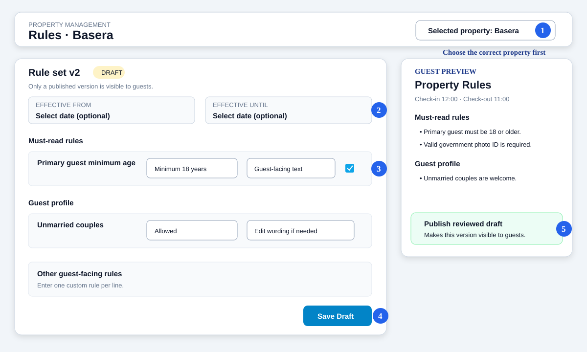

# Property Rules — Quick User Manual

For property owners, super admins, and authorised property managers.

## What this feature does

Property Rules stores guest-facing rules for one hotel or guest house. Published rules appear on the public booking page, and the accepted version is saved with each new booking for future reference.

Room amenities, prices, cancellation policies, and internal staff instructions are managed elsewhere. Do not enter them here.

## Open Property Rules

1. Sign in to the Admin Panel.
2. Select the correct property in the top header.
3. Go to **Inventory → Properties**.
4. Open the property and click **Property Rules**.

Always check the property name at the top before editing.

## Create or update rules

1. Set **Effective from** only when the rules should start on a future date.
2. Set **Effective until** only when the rules have an end date.
3. In each section, choose the correct option, for example **Allowed**, **Not allowed**, or **Prior approval required**.
4. Review the guest-facing sentence. Edit it only when the property needs clearer wording.
5. Tick **Must read** for rules guests must notice before booking.
6. Add any special rule under **Other guest-facing rules**, one rule per line.
7. Click **Save Draft**.

Recommended must-read items:

- Minimum age of the primary guest
- Accepted ID proof and rules for foreign guests
- Couple/group restrictions, if any
- Visitor restrictions
- Important smoking, alcohol, pet, or accessibility limitations

## Review before publishing

Use **Guest preview** on the right to check exactly what guests will read.

Before publishing, confirm:

- The correct property is selected.
- Check-in and check-out times are correct on the Property page.
- No rule conflicts with property amenities or room-category settings.
- Wording is clear, respectful, and does not promise unavailable services.
- Future start and end dates are correct.

## Publish rules

1. Save the draft.
2. Review the guest preview.
3. Click **Publish Version**.
4. Confirm the message.

Only a published version is shown to guests. Saving a draft does not change the public website.

## What guests see

On the booking page, guests see a short **Property Rules** summary and can open **Read all rules**. Before reserving, they must confirm that they have read and accepted the published rules.

The system saves a copy of that published version with the booking. Later changes should not alter the rules accepted for an older booking.

## Common tasks

| Task | What to do |
|---|---|
| Correct wording without going live | Edit and **Save Draft** |
| Make rules live now | Leave effective dates blank, save, review, and publish |
| Schedule future rules | Set **Effective from**, save, review, and publish |
| Add a unique property rule | Add one sentence under **Other guest-facing rules** |
| Change check-in/check-out time | Update it on the **Property** page, not here |
| Change refund terms | Use **Cancellation Policies** |
| Change room facilities | Use **Room Types / Room Amenities** |

## Troubleshooting

**Changes are not visible publicly**  
The changes may still be a draft. Open Property Rules and publish the reviewed version.

**Wrong property rules are displayed**  
Check the property selector in the top header and the booking page property.

**A future rule is not visible today**  
It becomes active on its effective-from date.

**The preview is empty**  
Select rule values and click **Save Draft** to refresh the preview.

**A rule conflicts with a room or amenity**  
Correct the source setting first (Property, Room Type, or Room), then update the guest-facing rule.

## Safe operating practice

- Keep drafts and publishing limited to authorised managers.
- Use neutral, lawful wording; never request Aadhaar numbers in rule text.
- Do not permanently delete a property or historical booking to change rules.
- Review rules whenever operations, local requirements, or property facilities change.
- Test the public booking page after every publication.

